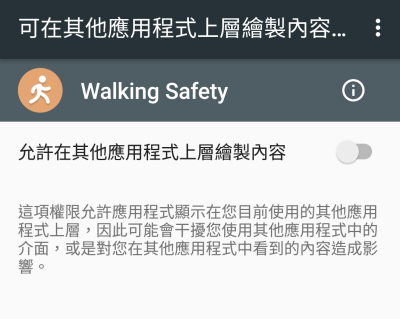

##這是一個邊走邊使用手機會跳出警示音/警告視窗的 App
透過 g-sensor 偵測使用者是否有在走路
目前有很多的使用者習慣性地邊走路邊使用手機
這是個非常危險的習慣
基於這樣的原因產生這支 App

其中,因為需要在其他的頁面顯示視窗,所以一開始會跟使用者要權限

設定頁面
有背景執行以及開機時自動啟動的功能

警告視窗,警示音的部分就沒有截圖了

希望能養成良好的習慣,也能保護自己與他人的安全 :)